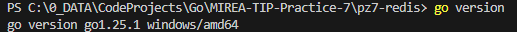
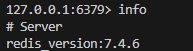
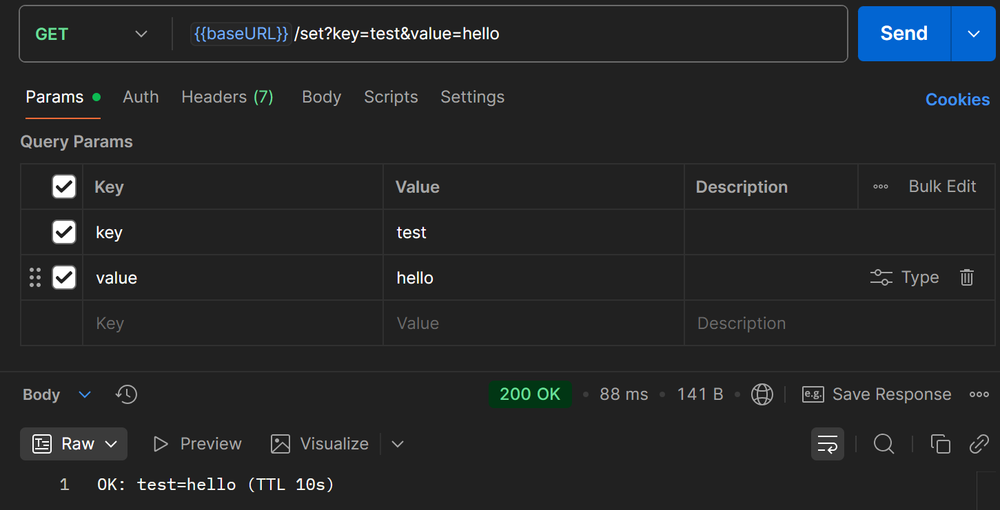
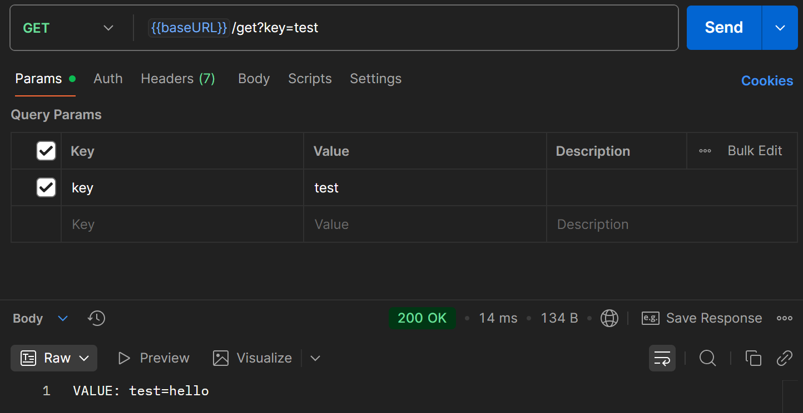
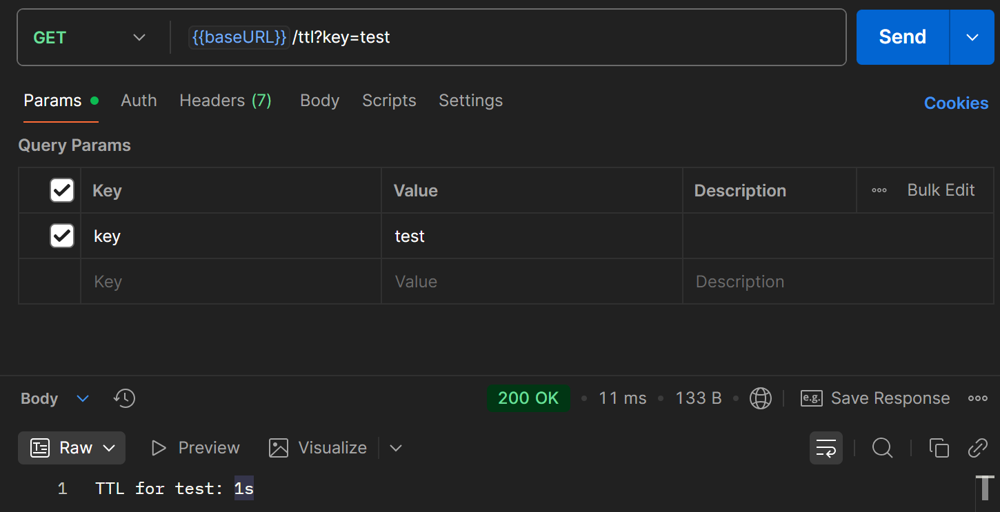
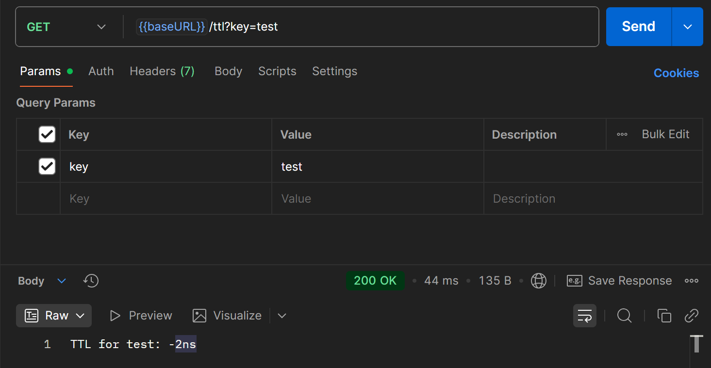

# Отчет по практическому занятию №7
## Подключение и работа с Redis (set/get, TTL). Реализация простого кэша.

### Выполнил: Туев Д.
### Группа: ЭФМО-01-25

## Цели занятия
- Освоить базовые операции работы с Redis из Go-приложения
- Научиться использовать команды SET, GET, задавать время жизни ключей (TTL)
- Реализовать кэширование данных для ускорения работы API
- Понять, в каких случаях кэш помогает снизить нагрузку на базу данных

## Описание окружения

**Версия Go:** 

  

**Версия Redis:** 



## Установка и настройка Redis

Redis был установлен в Docker-контейнере с использованием образа `redis:7.4-alpine`.

### Команда запуска Redis:
```bash
docker run -d --name redis -p 6379:6379 redis:7.4-alpine
```

### Настройка переменных окружения

Для работы приложения требуются следующие переменные окружения:

- **REDIS_IP** - IP-адрес Redis сервера

- **REDIS_PASS** - пароль для подключения к Redis

## Структура проекта

```bash
pz7-redis/
├── cmd/
│   └── server/
│       └── main.go
├── internal/
│   └── cache/
│       └── cache.go
└── go.mod
```
## Реализованный функционал
HTTP endpoints:

- GET /set?key=test&value=hello - сохранение значения в Redis с TTL 10 секунд

- GET /get?key=test - получение значения из Redis

- GET /ttl?key=test - проверка оставшегося времени жизни ключа

## Результаты тестирования

Для тестирования была сформирована [Postman коллекция](https://lively-flare-564043.postman.co/workspace/My-Workspace~fe2081e8-b325-4776-8b48-400d41f5b4bd/collection/42992055-ed6f448e-767b-4ee3-b8a3-0b65a8914a92?action=share&creator=42992055)

1. Сохранение значения в кэш



2. Получение значения из кэша



3. Проверка TTL ключа



4. Проверка истечения TTL (через 10+ секунд)



## Что такое Redis и зачем нужен TTL

Redis - это высокопроизводительная in-memory система хранения данных типа "ключ-значение". Все данные хранятся в оперативной памяти, что обеспечивает очень высокую скорость доступа.

TTL (Time-To-Live) - время жизни ключа в секундах. После истечения TTL ключ автоматически удаляется из Redis. Это необходимо для:

- Автоматической очистки устаревших данных

- Предотвращения переполнения памяти

- Обеспечения актуальности кэшированных данных

- Избежания ручного управления жизненным циклом данных

## Контрольные вопросы
### 1. Чем Redis отличается от реляционной БД?

Redis хранит данные в оперативной памяти (реляционные БД - на диске), не использует SQL, поддерживает различные структуры данных кроме таблиц, ориентирован на скорость работы.
### 2. Какие типы данных поддерживает Redis кроме строк?

Списки, множества, хэши, упорядоченные множества, битовые поля, геопространственные данные, потоки.
### 3. Зачем нужен TTL? Приведите примеры.

TTL нужен для автоматического удаления временных данных. Примеры: сессии пользователей, кэш популярных товаров, временные коды подтверждения, результаты запросов которые устаревают.
### 4. Как Redis помогает снизить нагрузку на PostgreSQL?

Redis кэширует часто запрашиваемые данные, уменьшая количество прямых обращений к PostgreSQL. Это снижает нагрузку на дисковую подсистему и CPU базы данных.
### 5. Что произойдёт, если ключ в Redis «протух» по TTL, а приложение попытается его прочитать?

Приложение получит ошибку "redis: nil" или аналогичную. В коде это обрабатывается проверкой ошибки, после которой данные можно заново получить из основного источника (БД) и сохранить в Redis.

## Выводы

В ходе практической работы был успешно реализован простой кэш на основе Redis. Настроены базовые операции SET/GET с поддержкой TTL. Redis продемонстрировал высокую производительность при работе с временными данными и эффективно решает задачу снижения нагрузки на основную базу данных.